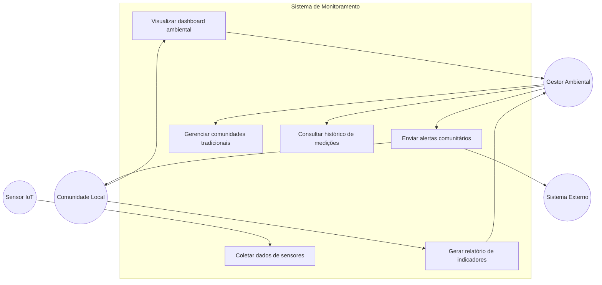

# Diagrama de Casos de Uso – Sistema de Monitoramento Ambiental Comunitário

```mermaid
graph TD
    subgraph Sistema de Monitoramento
        UC1[Coletar dados de sensores]
        UC2[Visualizar dashboard ambiental]
        UC3[Gerar relatório de indicadores]
        UC4[Enviar alertas comunitários]
        UC5[Gerenciar comunidades tradicionais]
        UC6[Consultar histórico de medições]
    end

    Ator1((Comunidade Local))
    Ator2((Gestor Ambiental))
    Ator3((Sensor IoT))
    Ator4((Sistema Externo))

    Ator3 --> UC1
    Ator1 --> UC2
    Ator1 --> UC3
    Ator2 --> UC4
    Ator2 --> UC5
    Ator2 --> UC6
    UC4 --> Ator1
    UC2 --> Ator2
    UC3 --> Ator2
    UC4 --> Ator4
```
