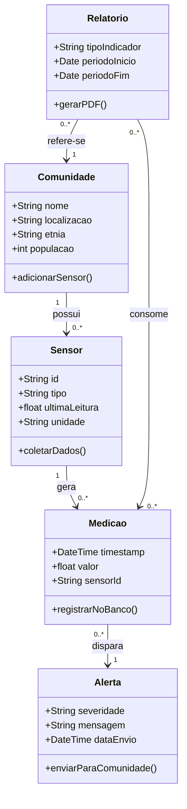

# Diagrama de Classes – Domínio do Monitoramento Ambiental

```mermaid
classDiagram
    class Comunidade {
        +String nome
        +String localizacao
        +String etnia
        +int populacao
        +adicionarSensor()
    }

    class Sensor {
        +String id
        +String tipo
        +float ultimaLeitura
        +String unidade
        +coletarDados()
    }

    class Medicao {
        +DateTime timestamp
        +float valor
        +String sensorId
        +registrarNoBanco()
    }

    class Alerta {
        +String severidade
        +String mensagem
        +DateTime dataEnvio
        +enviarParaComunidade()
    }

    class Relatorio {
        +String tipoIndicador
        +Date periodoInicio
        +Date periodoFim
        +gerarPDF()
    }

    Comunidade "1" --> "0..*" Sensor : possui
    Sensor "1" --> "0..*" Medicao : gera
    Medicao "0..*" --> "1" Alerta : dispara
    Relatorio "0..*" --> "1" Comunidade : refere-se
    Relatorio "0..*" --> "0..*" Medicao : consome
```
